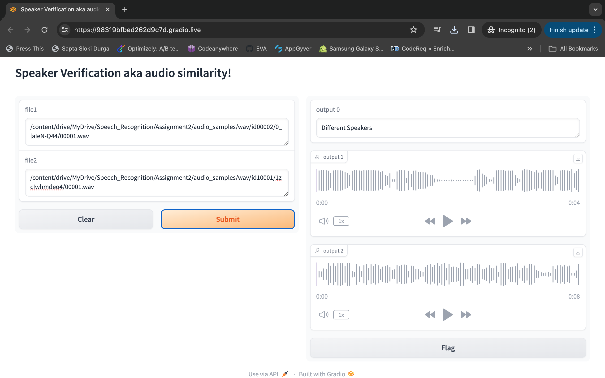

# sapa


### Code:

Below are the step to setup the code and perform training

### Setup:

After setting up the code as below, update the paths appropriately

> git clone https://github.com/ksasi/sapa.git

### Install Dependencies:

> cd sapa
> 
> pip install -r requirements.txt

## Speaker Verification

### Datasets :

- Create and change directory to ***dataset*** under ***Speaker_Verification***
- Download [VoxCeleb1-H (small subset)] (https://iitjacin-my.sharepoint.com/:u:/g/personal/d22cs051_iitj_ac_in/EVhTqG7PeDFBlkgHrG7WSJoB63ievtSFmE-PLdSxHtSNqA?e=Nlf8fX)
- Download [Kathbath dataset] (https://github.com/AI4Bharat/IndicSUPERB)

Dataset **Kathbath** structure after extraction :

```
Audio Data
data
├── telugu
│   ├── <split_name>
│   │   ├── 844483828886543-594-f.m4a
│   │   ├── 765429982765376-973-f.m4a
│   │   ├── ...
├── tamil
├── ...


Transcripts
data
├── telugu
│   ├── <split_name>
│   │   ├── transcription_n3w.txt
├── tamil
├── ...
```
Convert m4a to wav format as below :

> git clone https://github.com/AI4Bharat/IndicSUPERB.git

```
python utilities/structure.py \
  <dataset_root_path>/kb_data_clean_m4a \
  <dataset_root_path>/kb_data_clean_wav \
  <lang>
```

### Models Evaluation (VoxCeleb1-H (small subset)) :

Execute the below script to evaluate models (XLSR-Wav2Vec2, UniSpeech-SAT and WavLM-Base) with EER(%) using VoxCeleb1-H (small subset)

> cd Speaker_Verification
> 
> nohup python eval_voxceleb.py > <root_path>/log/eval_log_voxceleb.out &
> 

### Models Evaluation (Kathbath - Telugu) :

Execute the below script to evaluate models (XLSR-Wav2Vec2, UniSpeech-SAT and WavLM-Base) with EER(%) using test partition of Kathbath - Telugu dataset

> cd Speaker_Verification
> 
> nohup python eval_kathbath.py > <root_path>/log/eval_log_kathbath.out &
> 

### Fine-tune and evaluate WavLM model :

Execute the below script to fine-tune WavLM model on **valid partition** of Kathbath - Telugu dataset

> cd Speaker_Verification
> 
> nohup python train_WavLM.py > <root_path>/log/WavLM_log_finetune.out &
> 

Execute the below script to evaluate the fin-tuned WavLM mode on **test partition** of Kathbath - Telugu dataset

> cd Speaker_Verification
> 
> nohup python eval_WavLM.py > <root_path>/log/WavLM_log_ft_eval.out &
> 

## Source Separation

### Datasets :

- Setup LibriMix repo as below 

> git clone https://github.com/JorisCos/LibriMix.git
> 
> cd <root_folder>/LibriMix/metadata/Libri2Mix

Delete all folders , except **libri2mix_test-clean_info.csv** and **libri2mix_test-clean.csv**

- Execute the below script to generate LibriMix dataset

> cd <root_folder>/LibriMix
> 
> ./generate_librimix.sh storage_dir

where storage_dir = <root_folder>/dataset

### Model(SepFormer) Evaluation (LibriMix - LibriSpeech test clean partition) :

Execute the below script to perform evaluation of SepFormer on test split of (70-30 of LibriMix - LibriSpeech test clean partition)

> cd Source_Separation
> 
> nohup python eval_separator.py > <root_path>/log/eval_sepformer_librimix_batch_size8.out &

### Model(SepFormer) fine-tuning and Evaluation

Execute the below steps to fine-tune and evaluate SepFormer :

- Adopt the speechbrain [recipe](https://github.com/speechbrain/speechbrain/tree/develop/recipes/WSJ0Mix/separation)
- Execute eval_separator.py after updating the model with fine-tuned model

### Demo (Speaker Verification) :

Demo of **Speaker Verification** from audio inputs can be executed by running `Speaker_Verification_Demo.ipynb` ipython notebook in the Demo folder



### References

- LibriMix  - [Github Link](https://github.com/JorisCos/LibriMix/)
- Speechbrain - [Github Link](https://github.com/speechbrain/speechbrain/tree/develop/recipes/WSJ0Mix/separation)
- EER Metric - [blog](https://yangcha.github.io/EER-ROC/)
- VoxCeleb dataset - [Link](https://mm.kaist.ac.kr/datasets/voxceleb/)
- Kathbath dataset - [Link](https://github.com/AI4Bharat/IndicSUPERB)
- UniSpeech - [Github Link](https://github.com/microsoft/UniSpeech/tree/main/downstreams/speaker_verification)
- SepFormer Huggingface - [Link](https://huggingface.co/speechbrain/sepformer-whamr)
- Torchmetrics - [Link](https://lightning.ai/docs/torchmetrics/stable/audio/scale_invariant_signal_noise_ratio.html)